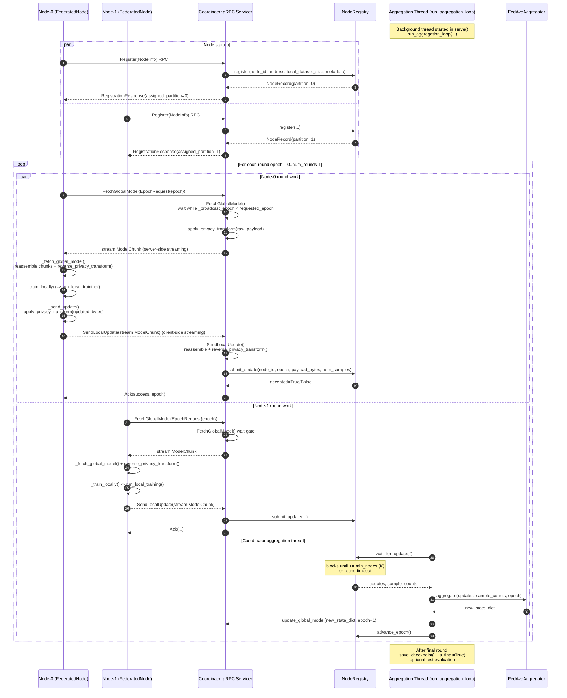

# Federated Learning Flow (2 Nodes + Coordinator)

This document explains the runtime flow of your synchronous FL system with:

- 1 coordinator
- 2 training nodes (`node-0`, `node-1`)
- K-out-of-N aggregation (`min_nodes` out of `total_nodes`)

---

## Model and Dataset Modes

The control-flow is the same for all current model types:

- `simple`
- `bpr`
- `neural_cf`
- `two_tower`

and both dataset modes:

- synthetic (`--data-dir`, optional `--val-data` / `--test-data`)
- MovieLens (`--movielens`, coordinator `--ml-data-root`)

Only two parts differ by mode:

- local loss in `trainer.py` (pairwise BPR vs pointwise BCE)
- coordinator evaluation in `server.py` (`evaluate_ranking` for MovieLens, `evaluate` for synthetic)

When the adversarial layer is active, two additional parts change:

- aggregation in `aggregator.py` (`RobustAggregator` instead of `FedAvgAggregator`)
- node data loading (`PoisonedBPRPairDataset` instead of `BPRPairDataset` on the malicious node)

---

## Standard FL Flow (No Adversarial)



---

## Adversarial FL Flow (Attack + Defense)

This diagram shows the same pipeline when one malicious node (`N1`) is running the data-poisoning attack and the coordinator is using a robust aggregation defense. In adversarial mode, pass the same `--attack-max-synth` value to the coordinator and all nodes so every participant instantiates the same user-embedding shape.

```mermaid
sequenceDiagram
    autonumber
    participant N0 as Node-0 (Clean)
    participant N1 as Node-1 (Malicious)
    participant GRPC as Coordinator gRPC Servicer
    participant REG as NodeRegistry
    participant AGG as Aggregation Thread
    participant RAGG as RobustAggregator
    participant AEVAL as adversarial/eval.py

    Note over N1: AttackConfig.enabled=True<br/>target_item_index=42, target_genre="Action"
    Note over N0,N1: All nodes started with --attack-max-synth=200<br/>Clean nodes reserve rows only; malicious node uses them

    par Node startup
        N0->>GRPC: Register(NodeInfo) RPC
        GRPC-->>N0: RegistrationResponse(partition=0)
    and
        N1->>GRPC: Register(NodeInfo) RPC
        GRPC-->>N1: RegistrationResponse(partition=1)
    end

    loop For each round epoch = 0..num_rounds-1

        par Node-0 (clean)
            N0->>GRPC: FetchGlobalModel(epoch)
            GRPC-->>N0: stream ModelChunk
            N0->>N0: run_local_training()<br/>(normal BPR loss on real users)
            N0-->>GRPC: SendLocalUpdate (clean delta)
        and Node-1 (malicious)
            N1->>GRPC: FetchGlobalModel(epoch)
            GRPC-->>N1: stream ModelChunk
            Note over N1: Before training:<br/>inject N_synth synthetic profiles<br/>(target item + filler + neutral items)<br/>via PoisonedBPRPairDataset
            N1->>N1: run_local_training()<br/>(BPR loss on real + synthetic users)<br/>target item embedding gets pushed
            N1-->>GRPC: SendLocalUpdate (poisoned delta)
        and Coordinator aggregation thread
            AGG->>REG: wait_for_updates()
            REG-->>AGG: {clean_delta, poisoned_delta}
            Note over AGG: global_state captured before aggregation
            AGG->>RAGG: aggregate(updates, sample_counts, epoch,<br/>global_state=current_state)
            Note over RAGG: 1. Compute Δ_i = local_i - global<br/>2. Compute L2 norms<br/>3. (focus) compute focus scores<br/>4. Clip norms to threshold θ<br/>5. (trimmed) trimmed mean per coord<br/>6. Reconstruct: new = global + Δ_agg
            RAGG-->>AGG: new_state_dict
            AGG->>GRPC: update_global_model(new_state_dict, epoch+1)
            AGG->>AEVAL: evaluate_with_target_exposure(model, dataset,<br/>target_item=42, target_genre="Action")
            Note over AEVAL: Computes per round:<br/>hit@K, ndcg@K (all users)<br/>segment_hit@K (Action users)<br/>target_hit@K (item 42 in top-K?)
            AEVAL-->>AGG: {hit@10, target_hit@10, ...}
            AGG->>REG: advance_epoch()
        end

    end

    Note over AGG: Final round:<br/>test-set adversarial eval<br/>prints target_hit@10 for attack impact report
```

---

## Function Call Map

### Node Side (`fedsys/node/client.py`)

- `FederatedNode.run()`
  - `self._register()`
  - loop for each round:
    - `self._fetch_global_model(epoch)`
      - RPC call: `FetchGlobalModel`
      - reassembles chunks
      - `reverse_privacy_transform(...)`
    - `self._train_locally(global_bytes, epoch)`
      - calls `run_local_training(...)` in `fedsys/node/trainer.py`
      - **if malicious**: dataloader is a `PoisonedBPRPairDataset` — synthetic profiles already mixed in
    - `self._send_update(updated_bytes, n_samples, epoch)`
      - `apply_privacy_transform(...)`
      - chunk generator yields `ModelChunk`
      - RPC call: `SendLocalUpdate`
      - receives `Ack`

### Coordinator RPC Side (`fedsys/coordinator/server.py`)

- `Register(...)` → `registry.register(...)`
- `FetchGlobalModel(...)` (server-streaming)
  - waits until requested epoch model is ready
  - `apply_privacy_transform(...)`
  - streams model chunks
- `SendLocalUpdate(...)` (client-streaming)
  - receives and reassembles chunks
  - `reverse_privacy_transform(...)`
  - extracts metadata (`epoch`, `num_samples`, `node_id`)
  - calls `registry.submit_update(...)`
  - returns `Ack`

### Coordinator Aggregation Thread (`run_aggregation_loop`)

- `registry.wait_for_updates()` — blocks until K updates or timeout
- `aggregator.aggregate(updates, sample_counts, epoch, global_state=...)`:
  - **`defense="none"`** → `FedAvgAggregator` — plain weighted mean
  - **`defense="clip_mean"`** → `RobustAggregator` — norm-clip deltas then mean
  - **`defense="clip_trimmed_mean"`** → norm-clip + coordinate-wise trimmed mean
  - **`defense="focus_clip_mean"`** → focus-score re-weight + norm-clip + mean
  - **`defense="focus_clip_trimmed_mean"`** → focus-score + clip + trimmed mean
- optional validation evaluation:
  - synthetic: `evaluate(...)` → loss / accuracy / auc_roc
  - MovieLens: `evaluate_ranking(...)` → hit@K / ndcg@K
  - **adversarial** (when `adv_target_item >= 0`): `evaluate_with_target_exposure(...)` → target_hit@K / target_ndcg@K / segment_hit@K
- `save_checkpoint(...)` — `model_epoch_N`, `model_best`, `model_final`
- `servicer.update_global_model(new_state, epoch+1)`
- `registry.advance_epoch()`
- after all rounds: optional test evaluation (same mode-specific evaluators)

---

## Adversarial Component Interactions

```
scripts/run_node.py
  └─ --attack flag
       └─ builds AttackConfig
            ├─ select_target_item()         (fedsys/adversarial/attack/target.py)
            ├─ poisoned_num_users()          (fedsys/adversarial/attack/poison.py)
            └─ build_poisoned_dataloader()  (fedsys/adversarial/attack/poison.py)
                  └─ PoisonedBPRPairDataset
                       ├─ BPRPairDataset    (clean shard, real users)
                       └─ _build_synthetic_profiles()  (fake users targeting item)

scripts/run_coordinator.py
  └─ --defense flag
       └─ CoordinatorConfig.defense_method
            └─ build_aggregator()           (fedsys/coordinator/aggregator.py)
                  ├─ "none"        → FedAvgAggregator
                  └─ other         → RobustAggregator
                                        (fedsys/adversarial/defense/aggregation.py)
                                        ├─ _delta()
                                        ├─ _l2_norm() + clip
                                        ├─ _focus_score()
                                        └─ _trimmed_mean_tensor()

  └─ --adv-target-item / --adv-target-genre
       └─ CoordinatorConfig.adv_target_item/genre
            └─ run_aggregation_loop() calls:
                  evaluate_with_target_exposure()  (fedsys/adversarial/eval.py)
                        ├─ _ranking_metrics()      (all users)
                        ├─ _ranking_metrics()      (segment users only)
                        └─ _target_exposure()      (target item rank for segment)
```

---

## Threading Model

Your coordinator process runs multiple threads with different responsibilities:

- **gRPC worker thread pool**: executes RPC handlers (`Register`, `FetchGlobalModel`, `SendLocalUpdate`)
- **Aggregation loop thread**: executes `run_aggregation_loop(...)`, performs aggregation and evaluation
- **Logger thread**: async telemetry flushes to JSONL / SQLite

`NodeRegistry` bridges gRPC threads and aggregation thread using a lock + condition:

- `submit_update(...)` stores one node's payload and notifies waiters
- `wait_for_updates(...)` sleeps efficiently until enough updates arrive

---

## Round Semantics

- `num_rounds` = number of global aggregation cycles.
- `local_epochs` = local passes each participating node performs per round.
- Effective per-node local training load (if node participates every round):

`total_local_epochs_per_node = num_rounds × local_epochs`

This is not identical to centralized "global epochs" because each node trains on only its partition.

---

## Integration Tests

The same flow above is exercised via:

**Standard tests:**

- `tests/synthetic/test_simple.py`
- `tests/synthetic/test_bpr.py`
- `tests/synthetic/test_neural_cf.py`
- `tests/synthetic/test_two_tower.py`
- `tests/movielens/test_simple.py`
- `tests/movielens/test_bpr.py`
- `tests/movielens/test_neural_cf.py`
- `tests/movielens/test_two_tower.py`

**Adversarial tests:**

- `tests/adversarial/test_poison.py` — unit: `PoisonedBPRPairDataset`, `AttackConfig`, profile builder
- `tests/adversarial/test_defense.py` — unit: all 5 `RobustAggregator` methods, focus score, trimmed mean
- `tests/adversarial/test_target.py` — unit: target item selection, genre scoring
- `tests/adversarial/test_eval.py` — unit: `evaluate_with_target_exposure`, `compare_attack_vs_clean`
- `tests/adversarial/test_integration.py` — full gRPC: 1 coordinator + 1 clean node + 1 malicious node, 3 defense scenarios
